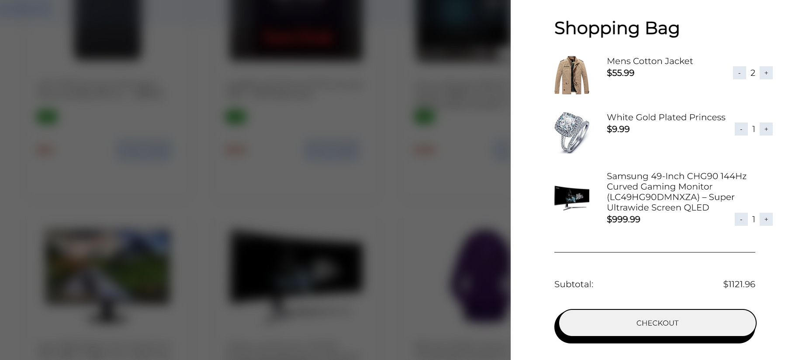

# odin-shopping-cart
I have provided a simple shopping cart application made using React.js, where users can add products to the cart, remove them, and see the updated total.

## Home Page

## Shopping Page

## Shopping bag view

[Checkout the Project](https://odin-shopping-cart-md9u1lpgz-subhranshu-sekhar-khilars-projects.vercel.app/)